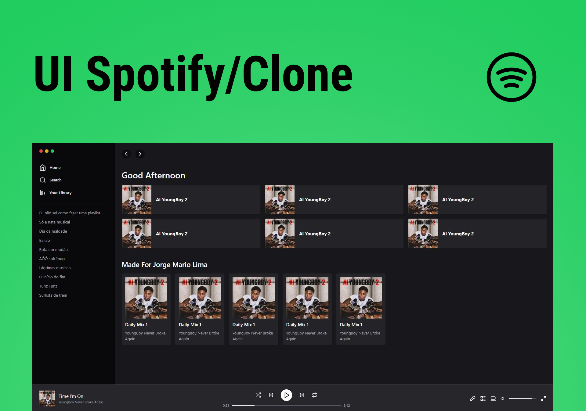

<h1 align="center"> UI Spotify/clone Web </h1>

 O projeto é um clone da interface web do Spotify 

  <a href="#-tecnologias">Tecnologias</a>&nbsp;&nbsp;&nbsp;|&nbsp;&nbsp;&nbsp;
  <a href="#-como-executar">Como executar</a>&nbsp;&nbsp;&nbsp;|&nbsp;&nbsp;&nbsp;
  <a href="#memo-licença">Licença</a>

  

 

  

## 🚀 Tecnologias

Esse projeto foi desenvolvido com as seguintes tecnologias:

- TypeScript
- React.js
- Next.js
- Tailwind CSS
- Lucide

## ▶ Como executar

1. Clone este repositório: `git clone https://github.com/gemario/ui-spotify-web.git`
2. Instale as dependências: `npm install`
3. Execute o aplicativo em modo de desenvolvimento: `npm run dev`
4. Abra o navegador em `http://localhost:3000` para ver o aplicativo em execução.

## :memo: Licença

Esse projeto está sob a licença MIT.